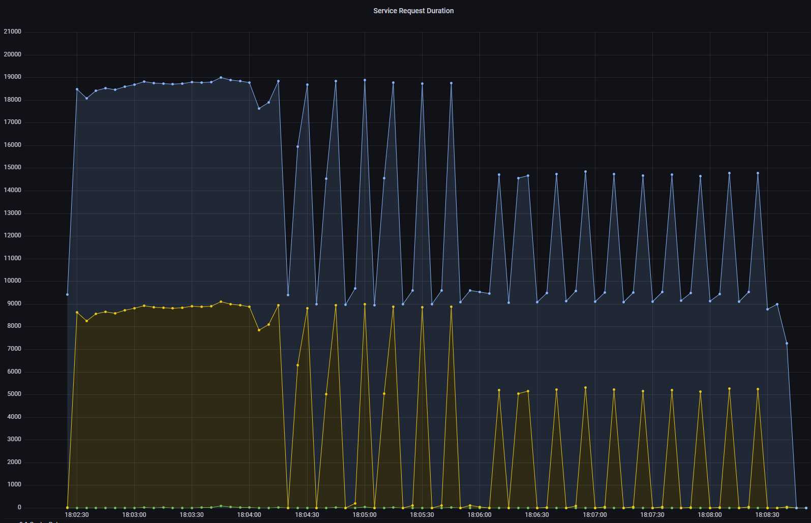

# Lab 5 Findings - Marcus Manos

- [Lab 5 Findings - [Marcus Manos]](#lab-5-findings---your-name)
  - [Introduction](#introduction)
  - [Findings](#findings)
    - [Finding 1](#finding-1)
    - [Finding 2](#finding-2)
    - [Finding N](#finding-n)
  - [Conclusion](#conclusion)

---

## Introduction

I tested the load.js script with 3 different values of 0.1, 0.5, and 0.9 to examine the differences in terms of performance and resource usage when using my API deployed on Azure. In each of the below visualizations the first group of data will be tested on the 0.5 cache rate (~17:35-17:41), the second on the 0.1 cache rate (~18:02-18:08), and the final on 0.9 cache rate (~18:12-18:18). 

## Findings

### Finding 1

The metric we are measuring here is "istio_request_duration_milliseconds_bucket", which displays the distribution of the duration of the requests. This means that it displays how long a request is taking for different cache rates. Looking at the visualizations it appears that the highest wait time occurred toward the end of the 0.5 cache rate test. The 0.9 cache rate visualization seems to make intuitive sense, the overall curves are lower than the other 2 visualizations since more values are being cached. One interesting finding is that the 0.1 cache rate seems to have an overall lower request time than the 0.5 cache rate. This is unintuitive since the cache rate is being decreased theoretically there should be higher request times since fewer values are cached.

### Finding 2

The next interesting finding came when I was examining the "Incoming Requests By Source And Response Code", which basically measures what requests were incoming among the three tests. The difference in distribution among the three tests seem to make logical sense, the peaks in the graph measure the operations per second, and seem to be clumped together depending on what the cache rate is. As the cache rate increases so does the peaks. The first grouping refers to the 0.5 cache rate, the second to 0.1 cache rate and the final to 0.9 cache rate. 

### Finding 3

The final finding comes from looking at the "Incoming Request Duration By Source" visualization. This measures how long each request took in seconds. One interesting thing to note is that the change from 0.5 to 0.1 is not very large, with only some minor differences in the distribution. However, the story changes when we switch to a 0.9 Cache rate. Nearly every percentile of requests dropped with the most significant being the 90th percentile of requests. This means that 90% of the requests took nearly 0 seconds to come in. This makes intuitive sense since as the cache rate increased Redis was caching more data and was able to increase the response times. 

## Conclusion

In conclusion, we saw the impact that caching has on the performance of an API. We saw that as the caching rate increased more requests tended to occur in a shorter period, compared to lower cache rates. This validates the theory behind caching: if we save more values then the response time will decrease and the operations per second will increase as well. 

